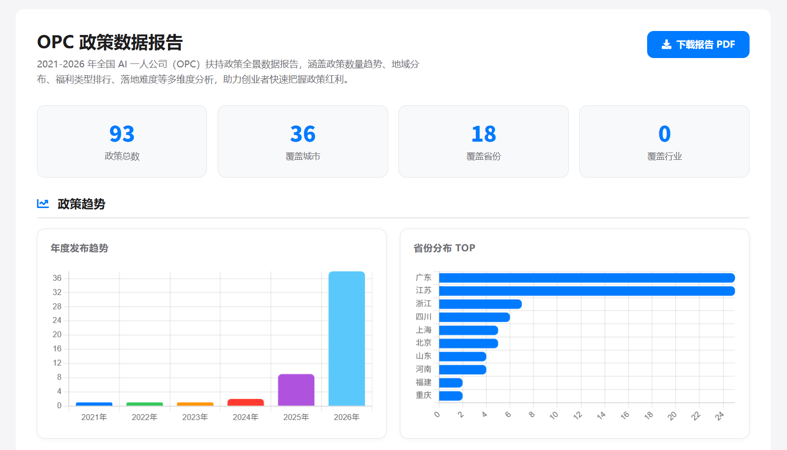
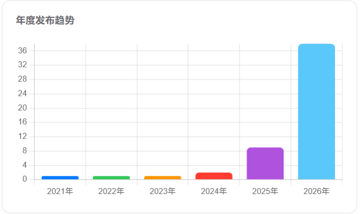
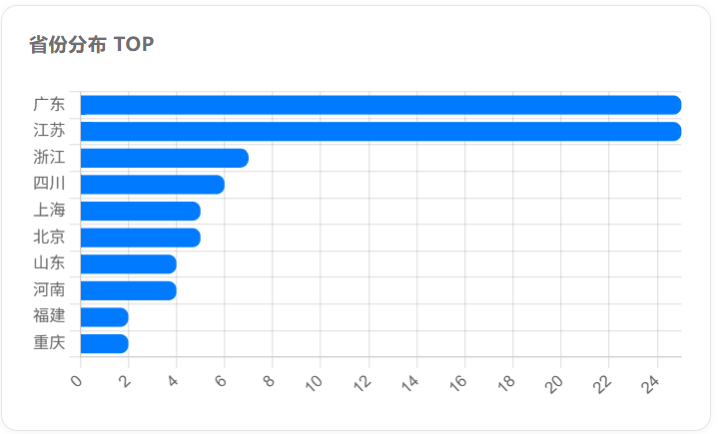
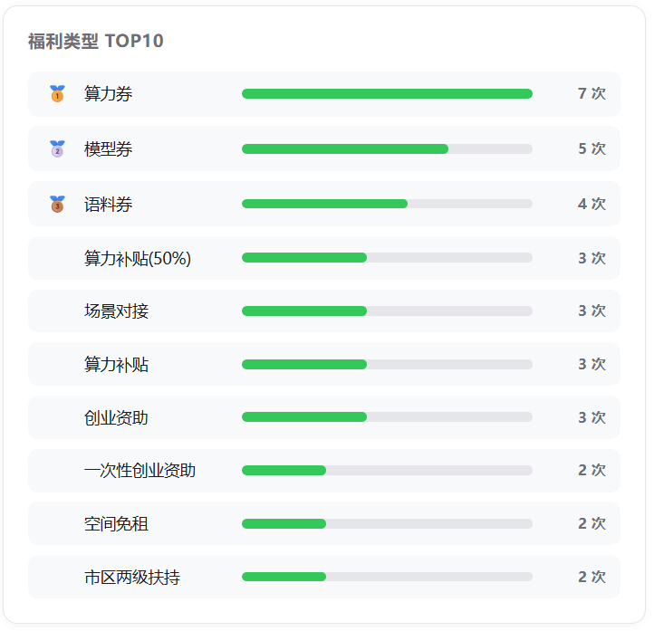

> 还在观望一人公司？2021-2026年国家与地方AI领域一人公司（OPC）扶持政策已密集落地。哪里的政策最香？哪类福利最实在？落地又有哪些坑？《全国AI一人公司（OPC）扶持政策全景数据报告》为你一次性拆解。

## 引言：一人公司，正从概念走向风口

在“AI+创业”深度融合的当下，一个人注册一家公司，不再是什么新鲜事。从独立开发者到知识IP变现，从AI工具创作者到跨境电商个体户，“一人公司”（One-Person Company，简称OPC）以其极低的运营成本和极高的灵活性，成为越来越多创业者的首选形态。

但政策红利在哪里？很多人只知道有扶持，却不知道具体有多少、在哪儿、怎么拿。为此，我们基于2021-2026年最全公开数据，编制了《全国AI一人公司（OPC）扶持政策全景数据报告》，用数据帮你透视政策风向，避免走弯路。

## 政策数量趋势：逐年攀升，2026年迎来高峰？

报告统计了2021年至2026年全国范围内针对AI一人公司（OPC）出台的专项扶持政策。一个明显的趋势是：政策发布数量呈**逐年上升**态势，尤其在2024年以后，随着大模型和AIGC技术的普及，各地纷纷加码对“AI+个体创业”的支持力度。

数据显示，2026年的政策总量预计将创历史新高——这绝非偶然。当AI工具让单兵作战成为可能，政策制定者也敏锐地捕捉到了这一新型经济形态的价值。对于创业者而言，这意味着**窗口期已经打开**，越早入场，越能享受早期政策红利。

## 地域分布：哪里的一人公司最“吃香”？

想注册一人公司，选对地方能事半功倍。报告对全国各省市政策进行了地域分布画像。

- **东部沿海及一线城市**依然领跑，尤其是北京、上海、深圳、杭州等地，不仅政策出台密度高，且配套了较为成熟的AI产业园区和孵化器。
- **新一线与强二线城市**正在快速追赶，如成都、武汉、苏州，它们往往提供更具吸引力的**落户奖励**和**办公场地补贴**，试图在AI一人公司赛道实现弯道超车。
- 值得注意的是，部分**中西部城市**在特定细分领域（如数据标注、AI+农业）推出了“定制化”扶持政策，竞争压力更小，落地空间更大。

报告将地域分布细化为可视化地图，让你一眼看清“政策洼地”在哪里。

## 福利类型排行：税收减免最硬核，但别忽略它

在一人公司的政策福利中，哪种最受欢迎？报告对百余条政策进行福利拆解，给出了**福利类型人气/含金量排行**：

1. **企业所得税/个人所得税减免**——真金白银，稳居榜首，部分地区最高可享受“三免三减半”甚至更高力度优惠。
2. **一次性创业补贴**——门槛低、到账快，适合刚起步的创业者。
3. **社保补贴与房租补贴**——长线但实用，能有效降低每月固定开支。
4. **AI算力券/云服务补贴**——这是近两年新兴的福利类型，尤其针对AI类一人公司，价值可达数万元，务必重点关注。
5. **免费法律、财务托管服务**——看似不起眼，但能帮你省下不少外包费用。

报告不仅列出了排行，还详细说明了每种福利的申请条件和常见“隐藏门槛”，助你精准匹配自身业务。

## 落地难度：政策虽好，落地有讲究

不少创业者遇到过“看着很美，申请却被拒”的窘境。报告独辟蹊径，首次引入“**落地难度指数**”概念，从申请环节数量、审核周期、开票要求、实际办公地址查验等维度进行打分。

结论很真实：**政策力度大的地方，往往审核也更严格；而落地难度低的地方，政策力度可能相对温和**。例如，某些对注册资本实行“认缴+零门槛”的地区，反而要求提供详细的商业计划书和AI技能证明。

报告针对不同创业阶段（初创期、成长期）给出了落地建议：是选择“高难度高奖励”的先行区，还是“低门槛快速注册”的普惠区？看完报告，你的心里会有更清晰的答案。

## 这份报告能为你做什么？

作为覆盖 **2021-2026年** 的全国性数据报告，它不只是冷冰冰的统计，更是**创业者手中的指南针**：

- **政策查询**：快速定位你所在城市或意向城市的最新OPC扶持政策。
- **趋势预判**：了解未来两年政策可能的方向，提前布局业务。
- **避坑指南**：掌握落地难点，避免因材料不足或理解偏差而错失补贴。

如果你正准备注册一人公司，或者已经在运营但尚未完整享受政策福利，这份报告值得花5分钟仔细阅读。

👉 **点击这里查看完整报告：** [《全国AI一人公司（OPC）扶持政策全景数据报告》](/policy/report/)

## 总结：政策红利期，一人公司正当时

一人公司的形式是“一个人”，但背后依托的是时代给予的“全栈式”政策支持。从数量增长到地域扩散，从福利加码到落地优化，2026年无疑是一人公司创业者们大有可为的一年。

**看懂政策，才能乘势而上。** 希望这份《全国AI一人公司（OPC）扶持政策全景数据报告》能成为你创业路上的第一个“得力员工”。

现在就点击链接，看看属于你的政策红包有多大吧！

